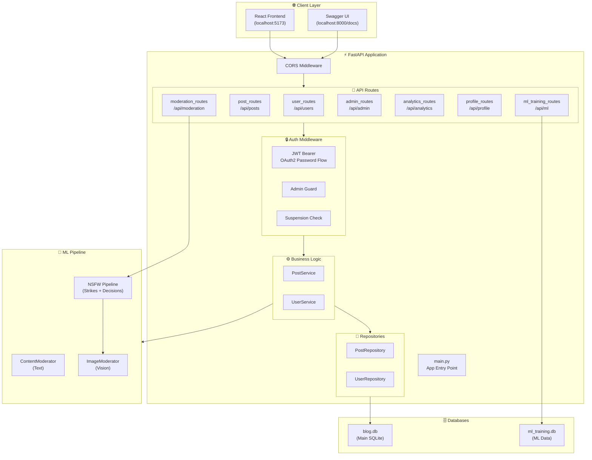
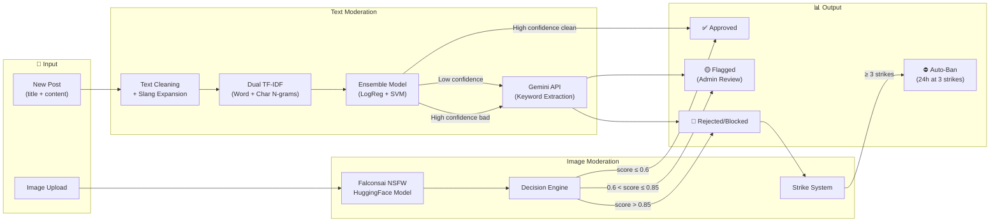
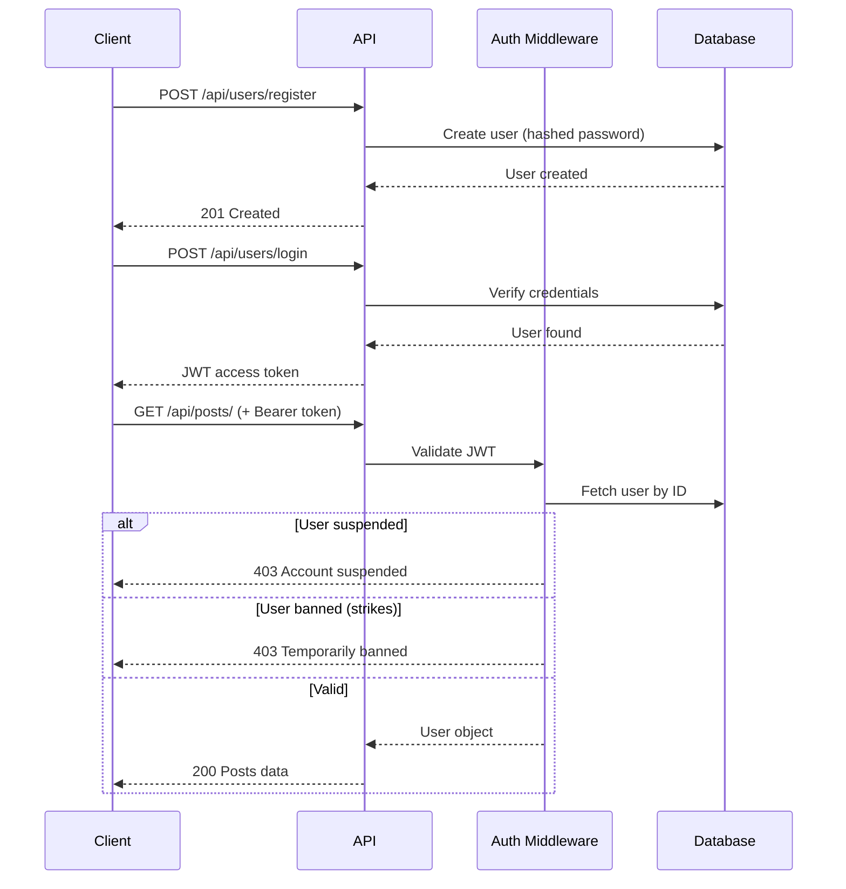
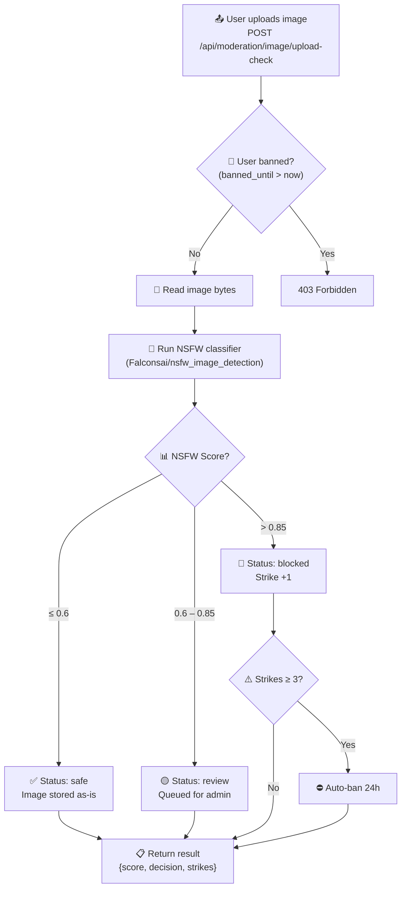

# Blog Backend API

A **FastAPI** backend for a modern blog platform with clean architecture, JWT authentication, ML-powered content moderation, NSFW image detection, and a strike-based ban system.

---

## 🏗️ System Architecture



---

## 🧠 ML Content Moderation Pipeline



---

## 📂 Project Structure

```
blog_backend/
├── app/
│   ├── main.py                    # FastAPI app, lifespan, router registration
│   ├── api/                       # Route handlers (controllers)
│   │   ├── user_routes.py         #   Registration, login, JWT
│   │   ├── post_routes.py         #   CRUD posts
│   │   ├── moderation_routes.py   #   Text check, image upload, NSFW pipeline
│   │   ├── admin_routes.py        #   Dashboard, user/post management
│   │   ├── analytics_routes.py    #   Usage analytics
│   │   ├── profile_routes.py      #   User profiles
│   │   └── ml_training_routes.py  #   ML model training management
│   ├── core/                      # Configuration & security
│   │   ├── config.py              #   Pydantic settings (.env loader)
│   │   └── security.py            #   JWT encode/decode, password hashing
│   ├── db/                        # Database engines & sessions
│   │   ├── database.py            #   Main async SQLite engine
│   │   └── ml_database.py         #   Separate ML training DB
│   ├── middleware/                 # Auth dependencies
│   │   └── auth_middleware.py     #   get_current_user, get_admin_user
│   ├── models/                    # SQLAlchemy ORM models
│   │   ├── user.py                #   User (auth, strikes, bans)
│   │   ├── post.py                #   Post (moderation status)
│   │   ├── image.py               #   Image (original, blurred, NSFW score)
│   │   ├── moderation_log.py      #   Flagged keyword logs
│   │   ├── analytics.py           #   Analytics data
│   │   └── user_profile.py        #   Extended profile
│   ├── repositories/              # Data access layer
│   │   ├── post_repository.py     #   Post CRUD queries
│   │   └── user_repository.py     #   User CRUD queries
│   ├── schemas/                   # Pydantic request/response models
│   │   ├── user_schema.py
│   │   ├── post_schema.py
│   │   ├── image_schema.py
│   │   ├── admin_schema.py
│   │   └── profile_schema.py
│   ├── services/                  # Business logic
│   │   ├── post_service.py        #   Post CRUD + moderation integration
│   │   └── user_service.py        #   User operations
│   └── ml/                        # Machine Learning modules
│       ├── content_moderator.py   #   Two-stage text moderation (TF-IDF + Gemini)
│       ├── image_moderator.py     #   HuggingFace NSFW image classifier
│       ├── deepai_moderator.py    #   NSFW pipeline (decisions + strikes)
│       ├── train_from_csv.py      #   Training script for text classifier
│       ├── training_data.py       #   Training data utilities
│       └── models/                #   Serialized model artifacts (.pkl)
├── .env                           # Environment variables
└── requirements.txt               # Python dependencies
```

---

## 🔐 Authentication Flow



---

## 🖼️ Image Moderation Pipeline



---

## 📡 API Reference

### Users
| Method | Path | Auth | Description |
|--------|------|------|-------------|
| POST | `/api/users/register` | No | Register a new user |
| POST | `/api/users/login` | No | Login and receive JWT |
| GET | `/api/users/me` | Yes | Get current user profile |
| GET | `/api/users/` | No | List all users |
| PUT | `/api/users/{id}` | Yes | Update user |
| DELETE | `/api/users/{id}` | Yes | Delete user |

### Posts
| Method | Path | Auth | Description |
|--------|------|------|-------------|
| POST | `/api/posts/` | Yes | Create a post (auto-moderated) |
| GET | `/api/posts/` | No | List published posts |
| GET | `/api/posts/{id}` | No | Get post by ID |
| PUT | `/api/posts/{id}` | Yes | Update post (owner only) |
| DELETE | `/api/posts/{id}` | Yes | Delete post (owner only) |

### Moderation
| Method | Path | Auth | Description |
|--------|------|------|-------------|
| POST | `/api/moderation/check` | No | Preview-check text content |
| POST | `/api/moderation/image` | Yes | Upload image (HuggingFace check) |
| POST | `/api/moderation/image/upload-check` | Yes | Upload image (NSFW pipeline + strikes) |
| GET | `/api/moderation/image/{id}` | No | View image (blurred if explicit) |
| POST | `/api/moderation/image/{id}/appeal` | Yes | Appeal flagged image |
| GET | `/api/moderation/image/review` | Yes | List images pending review |
| GET | `/api/moderation/image_appeals` | Yes | List appealed images |
| PUT | `/api/moderation/image/{id}/approve` | Yes | Approve appealed image |
| GET | `/api/moderation/flagged` | Yes | List flagged posts |
| PUT | `/api/moderation/{id}/approve` | Yes | Approve flagged post |
| PUT | `/api/moderation/{id}/reject` | Yes | Reject flagged post |

### Admin
| Method | Path | Auth | Description |
|--------|------|------|-------------|
| GET | `/api/admin/stats` | Admin | Dashboard statistics |
| GET | `/api/admin/users` | Admin | List all users |
| PUT | `/api/admin/users/{id}/suspend` | Admin | Suspend user |
| PUT | `/api/admin/users/{id}/unsuspend` | Admin | Unsuspend user |
| PUT | `/api/admin/users/{id}/promote` | Admin | Promote/demote admin |
| DELETE | `/api/admin/users/{id}` | Admin | Delete user |
| GET | `/api/admin/posts` | Admin | List all posts |
| PUT | `/api/admin/posts/{id}/suspend` | Admin | Suspend post |
| PUT | `/api/admin/posts/{id}/unsuspend` | Admin | Unsuspend post |
| PUT | `/api/admin/posts/{id}/status` | Admin | Update moderation status |
| DELETE | `/api/admin/posts/{id}` | Admin | Delete post |

---

## ⚙️ Tech Stack

| Component | Technology |
|-----------|-----------|
| **Framework** | FastAPI + Uvicorn |
| **Database** | SQLite (async via aiosqlite) |
| **ORM** | SQLAlchemy 2.0 (async) |
| **Auth** | JWT (python-jose) + bcrypt |
| **Text ML** | TF-IDF + Logistic Regression + SVM Ensemble |
| **Image ML** | HuggingFace Transformers (Falconsai/nsfw_image_detection) |
| **AI Fallback** | Google Gemini 1.5 Flash (keyword extraction) |
| **Validation** | Pydantic v2 |

---

## 🚀 Quick Start

```bash
# 1. Create & activate virtual environment
python -m venv venv
venv\Scripts\activate          # Windows
# source venv/bin/activate     # macOS/Linux

# 2. Install dependencies
pip install -r requirements.txt

# 3. Configure environment
cp .env.example .env           # Edit with your keys

# 4. Train the text moderation model (optional)
python -m app.ml.train_from_csv

# 5. Run the server
uvicorn app.main:app --reload --host 127.0.0.1 --port 8000
```

API docs at **http://127.0.0.1:8000/docs**

---

## 🔧 Environment Variables

| Variable | Default | Description |
|----------|---------|-------------|
| `DATABASE_URL` | `sqlite+aiosqlite:///./blog.db` | Async database URL |
| `SECRET_KEY` | — | JWT signing key |
| `ACCESS_TOKEN_EXPIRE_MINUTES` | `30` | Token lifetime (minutes) |
| `APP_NAME` | `Blog API` | Application display name |
| `GEMINI_API_KEY` | — | Google Gemini API key (text moderation fallback) |
